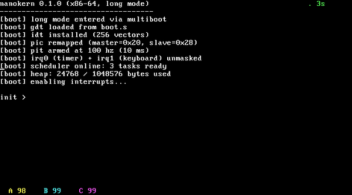

# nanokern

[](https://github.com/f4rkh4d/nanokern/actions/workflows/ci.yml)

a multitasking x86-64 kernel in 785 lines of c and asm. boots under qemu, runs a preemptive round-robin scheduler over three demo tasks, handles the timer irq, reads the ps/2 keyboard, hands out memory from a bump heap. designed to fit in my head.



## boot

```
make run
```

you should see:

```
nanokern 0.1.0 (x86-64, long mode)
-----------------------------------
[boot] long mode entered via multiboot
[boot] gdt loaded from boot.s
[boot] idt installed (256 vectors)
[boot] pic remapped (master=0x20, slave=0x28)
[boot] pit armed at 100 hz (10 ms)
[boot] irq0 (timer) + irq1 (keyboard) unmasked
[boot] scheduler online: 3 tasks ready
[boot] heap: 224 / 1048576 bytes used
[boot] enabling interrupts...

init >
A 25  B 25  C 25                   . 1s
```

three demo tasks (A, B, C) print their name and a counter on the bottom row. the counters advance at roughly 25 Hz each, which is exactly 100 Hz / 4 (the timer rate divided across the init loop and the three workers). that division IS the scheduler.

type something. the keyboard driver echoes it. a small seconds-since-boot counter ticks in the top-right corner, proving the timer irq is live.

## proof it actually multitasks

each demo task also writes its initial to qemu's debugcon port. with `make smoke` you get an externally-observable trace:

```
$ make smoke
[smoke] booting in qemu for 4 seconds...
[smoke] debugcon stream: CBACBACBACBACBACBACBACBACBA...
[smoke] task counts after 4s: A=77 B=77 C=78
[smoke] expected ~75 each (100 Hz / 4 tasks * 3 sec). pass.
```

the smoke test is wired up in CI ([`.github/workflows/ci.yml`](.github/workflows/ci.yml)) so every push to main confirms a real kernel still boots and a real scheduler still rotates.

## toolchain

```
brew install nasm qemu x86_64-elf-gcc   # macOS
apt install nasm qemu-system-x86 gcc-x86-64-linux-gnu   # debian-ish
```

`make` builds `build/nanokern.elf`. qemu's `-kernel` flag loads multiboot elfs directly, no iso or grub required.

## what's in it

- **boot.s.** multiboot (v1) header, 32-bit entry, identity-maps the first 1 GiB with 2 MiB pages, enables PAE + LME + paging, loads a 64-bit gdt, long-jumps to kmain. all in under 100 lines of nasm.
- **idt + isr stubs.** 256 vectors, generated with nasm macros that push a dummy error code for vectors that don't push one, so the common dispatcher sees a uniform stack.
- **pic.** legacy 8259 remap (master to 0x20, slave to 0x28) because legacy-free x86 is a lie.
- **pit.** channel 0 at 100 hz, 10 ms quantum.
- **scheduler.** preemptive round-robin over a circular ready ring. timer irq calls `sched_tick`, which saves the current task's callee-saved registers via a 14-instruction `context_switch` and rotates `rsp` to the next task. each task has its own 8 KiB kernel stack with a hand-built initial frame so the first switch to a new task lands inside `task_entry_trampoline`. ring 0 only for now; user mode is roadmap.
- **keyboard.** ps/2 irq1, scancode set 1, fixed us layout (no shift/ctrl yet), 128-byte ring buffer consumed by the init loop.
- **heap.** a bump allocator. 1 MiB pool. `kfree` doesn't exist yet because a bump with no slab has nothing honest to do there.
- **vga.** 80x25 text, a tiny `vga_printf` that knows `%s %c %d %x %p`.

## what's *not* in it yet (the v0.4 roadmap)

- **syscalls via `int 0x80`.** `write`, `read`, `spawn`, `exit`, `sleep`.
- **higher-half kernel at `0xffffffff80000000`.** currently identity-mapped, which is simpler but not how any serious kernel is laid out.
- **slab + real pmm.** bump is fine for boot but won't go the distance.
- **stage1/stage2 bootsector.** the multiboot shortcut is a concession to iteration speed. replacing it with a 512-byte real-mode stage1 is a deliberate future loss.
- **user mode via sysret + a tss.** preempting ring-3 means a tss with rsp0, syscall msr setup, and not getting any of that wrong.
- **a real `kfree`.** when the bump goes, the slab arrives.

## layout

```
src/
  boot/boot.s              multiboot entry, 32-bit to long mode
  kernel/
    main.c                 kmain + demo tasks
    vga.c, vga.h           80x25 text + tiny printf
    idt.c, idt.h           256-vector idt, dispatcher
    pic.c, pic.h           8259 remap + eoi + mask
    pit.c, pit.h           channel 0 timer
    kbd.c, kbd.h           ps/2 irq + ring buffer
    heap.c, heap.h         bump allocator
    sched.c, sched.h       round-robin scheduler
    types.h                fixed-width ints + port i/o + debugcon
    arch/isr_stubs.s       256 isr stubs, nasm-generated
    arch/sched_asm.s       context_switch + task_entry_trampoline
linker.ld                  elf64 layout, starts at 1 MiB physical
Makefile                   clang-free, uses x86_64-elf-gcc + nasm
scripts/smoke.sh           4-second qemu boot + scheduler-fairness check
```

785 lines of c and asm total, counted by `find src -type f | xargs wc -l`.

## why

the jump from "i use an os" to "i understand what the cpu does before `main()`" is one of the largest in programming. every abstraction you take for granted (processes, files, scheduling, virtual memory) turns out to be a few hundred lines of c and an `lgdt`. i know this is a toy. that's the whole point. real kernels are too big to hold in my head at once. this one fits.

## license

MIT.
